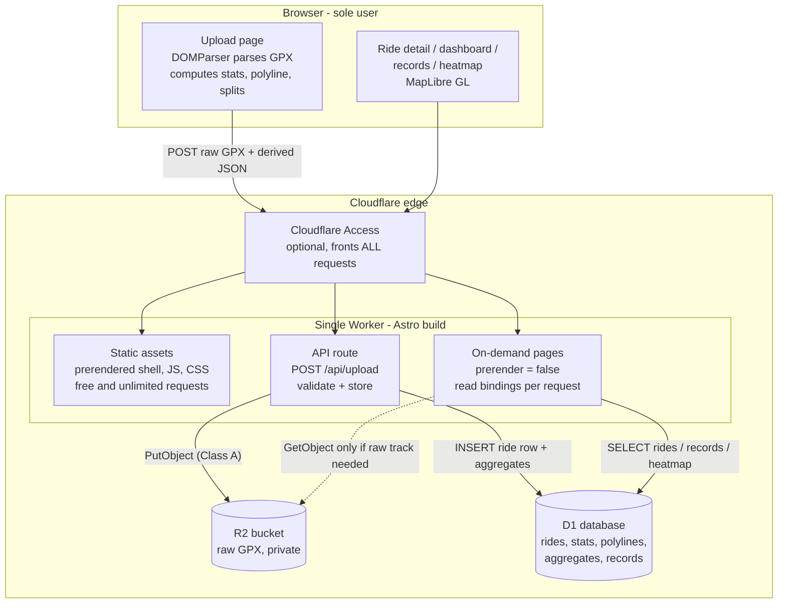

# Cloudflare architecture research — private ride tracker

Research date: **2026-07-16**. All limits below were read from the live pages cited on this date. Cloudflare changes limits; re-verify before relying on a number months from now. Every claim links its owning primary source (developers.cloudflare.com / docs.astro.build). No blog posts were used.

---

## Summary & recommendation

**Deploy as a single Cloudflare Worker** built by Astro with the `@astrojs/cloudflare` adapter — not Cloudflare Pages. This is no longer a style choice: the current Astro adapter has **removed Cloudflare Pages support entirely** ("The Astro Cloudflare adapter no longer supports deployment on Cloudflare Pages" — [adapter docs](https://docs.astro.build/en/guides/integrations-guide/cloudflare/)), and Cloudflare's own migration guide positions Workers as the platform with "a distinctly broader set of features" ([Migrate from Pages](https://developers.cloudflare.com/workers/static-assets/migration-guides/migrate-from-pages/)). Pages Functions and Pages Deploy Hooks are therefore moot for a new build.

**Recommended shape:**

- **One Astro project → one Worker + static assets.** App shell, JS, CSS, MapLibre bundle are prerendered/static (Astro's default `output: 'static'`); the ride-detail page, dashboard, records, and heatmap pages are `export const prerender = false` so they render on demand, reading bindings at request time. **New rides appear with zero rebuilds.**
- **Raw GPX → R2** via an Astro API route (`src/pages/api/upload.ts`) on the same Worker. R2 buckets are private by default; the Worker binding is the only access path.
- **Derived data → D1** (per-ride stats row, simplified polyline as TEXT, aggregates/records/heatmap). D1 wins over KV mainly on **consistency** (KV writes can take "up to 60 seconds or more" to be visible — fatal for "upload ride, immediately see dashboard") and on **query fit** (records = one SQL query, not N KV reads). Free limits (5M rows read/day, 100k written/day) are absurd overkill for one user.
- **Parse GPX client-side in the browser before upload.** The browser has `DOMParser`; Workers do not, and the free plan's **10 ms CPU cap per request** makes in-Worker parsing of a 600 KB XML file marginal-to-over-budget (estimate — see §2). The upload POST carries the raw GPX (to R2, archival) plus the computed stats/polyline JSON (to D1). The Worker only validates and stores.
- **Auth (facts in §4, decision is a separate ticket):** Cloudflare Access has a documented one-click "Enable Cloudflare Access" for `workers.dev` domains and sits at the edge in front of *all* requests (assets + API routes); the Zero Trust free tier covers up to 50 users. A basic-auth check inside the Worker only protects requests that actually reach the Worker — static assets are served *before* the Worker by default, so Worker-side auth requires `run_worker_first: true` (which then makes asset requests count against the 100k/day request cap — irrelevant at one-user traffic).

### Recommended architecture

Upload flow: browser parses → `POST /api/upload` → Worker writes GPX to R2 + one D1 transaction (ride row + updated aggregates). Read flow: SSR page → D1 SELECT → HTML + JSON for MapLibre. R2 is touched on reads only if the full-resolution track is wanted (playback can use the stored polyline, or re-fetch raw GPX through the Worker).

---

## 1. Storage

### Raw GPX: R2

Free tier ([R2 pricing](https://developers.cloudflare.com/r2/pricing/)):

- Storage: **10 GB-month / month** (Standard storage only — "The free tier only applies to Standard storage").
- **Class A** (writes: `PutObject`, `ListObjects`, multipart ops, …): **1 million requests / month**.
- **Class B** (reads: `GetObject`, `HeadObject`, …): **10 million requests / month**.

At ~600 KB/ride, 10 GB ≈ **~17,000 rides** — decades of headroom. One upload = one Class A op; nowhere near limits.

### Derived data: R2 vs KV vs D1

| | R2 | Workers KV | D1 |
|---|---|---|---|
| Free reads | 10M Class B / month ([pricing](https://developers.cloudflare.com/r2/pricing/)) | **100,000 / day** ([KV pricing](https://developers.cloudflare.com/kv/platform/pricing/)) | **5 million rows read / day** ([D1 pricing](https://developers.cloudflare.com/d1/platform/pricing/)) |
| Free writes | 1M Class A / month | **1,000 / day** (also 1,000 deletes/day, 1,000 lists/day) | **100,000 rows written / day** |
| Free storage | 10 GB | **1 GB**, value ≤ **25 MiB**, key ≤ 512 B ([KV limits](https://developers.cloudflare.com/kv/platform/limits/)) | **5 GB total**; **500 MB per DB** on free, max 10 DBs; row/string/BLOB ≤ **2,000,000 bytes** ([D1 limits](https://developers.cloudflare.com/d1/platform/limits/)) |
| Consistency | Strong per-object read-after-write within the binding | **Eventually consistent**: "Changes may take up to 60 seconds or more to be visible in other global network locations as their cached versions of the data time out." Locally "usually immediately visible" but not guaranteed. "KV is not ideal for applications where you need support for atomic operations or where values must be read and written in a single transaction." ([How KV works](https://developers.cloudflare.com/kv/concepts/how-kv-works/)) | SQLite semantics; single primary; transactional |
| "List all rides for dashboard" | `ListObjects` + N GETs, or one big index object you rewrite on every upload | `list()` + N reads, or one index blob rewritten per upload (racy under eventual consistency) | `SELECT id, date, distance, … FROM rides ORDER BY date` — one query |
| "Fetch one ride's JSON" | fine | fine | fine (`SELECT … WHERE id = ?`, polyline TEXT ≤ 2 MB is plenty for a simplified 4k-point track) |
| "Query records (longest ride, biggest climb, fastest 10k…)" | impossible without reading everything | impossible without reading everything or maintaining hand-rolled indexes | `SELECT MAX(...)`, `ORDER BY x LIMIT 1`, window queries — native |

**Recommendation: D1 for all derived data.** Justification:

1. **Consistency is the killer for KV.** The core UX loop is *upload a ride → immediately look at the dashboard*. KV documents a 60+ second visibility lag for exactly this pattern, and explicitly disclaims read-modify-write workflows — which is what "update aggregate totals on upload" is. D1 is transactional: insert ride + update aggregates in one batch, read it back instantly.
2. **Records and dashboard are queries, not key lookups.** SQL answers "top 5 longest rides" and "total km per year" in one statement; KV/R2 would force a hand-maintained index object.
3. **Limits are a non-issue.** One user generating a handful of writes per upload and a few hundred row-reads per page view sits ~4 orders of magnitude under D1's free allowances (which "reset daily at 00:00 UTC").
4. Heatmap data (e.g., all simplified polylines, or a binned point grid) fits comfortably: 4,000 rides × ~20 KB simplified polyline ≈ 80 MB, well under the 500 MB free per-DB cap. If a single precomputed heatmap blob ever exceeded the 2 MB row cap, spill that one artifact to R2.

R2 stays in the picture solely for raw GPX archival (its actual strength: cheap blob storage).

## 2. Parsing / compute

Free-plan Worker constraints ([Workers limits](https://developers.cloudflare.com/workers/platform/limits/)):

- Requests: **100,000 / day**.
- CPU time: **10 ms per request** on Free. (Paid default is 30 s, configurable to "5 min (300,000 ms)" — the historical 10 ms figure is still the **current** free number as of this fetch; what changed over the years is the *paid* tier, 50 ms → 30 s default.)
- Memory: **128 MB** (both plans).
- Worker size: 3 MB compressed on Free.

**No DOMParser in Workers.** The [Workers Web standards page](https://developers.cloudflare.com/workers/runtime-apis/web-standards/) lists the supported web APIs (fetch, URL, TextEncoder, streams, crypto, …); no DOM or `DOMParser`/`XMLHttpRequest`-style XML parsing API appears. (The docs don't state the absence explicitly — callout below.) Server-side XML options that do work: pure-JS parsers such as [fast-xml-parser](https://github.com/NaturalIntelligence/fast-xml-parser) (no DOM dependency), a streaming SAX-style parser, or regex extraction of `<trkpt>` attributes (GPX from a single known exporter — Komoot — is regular enough for this, though a real parser is safer).

**Does 600 KB / 4,000 points fit in 10 ms CPU? Marginal — treat as no.** *Estimate, not a documented figure:* JS XML parsers process on the order of tens of MB/s of XML per CPU core, so 600 KB ≈ **5–40 ms of CPU** depending on parser and allocation churn; the numeric pass over 4,000 points (haversine distances, elevation smoothing, gradients, splits) is trivially sub-millisecond. That straddles the 10 ms cap: it might work, might 1102-error, and will be flaky. Three placements:

- **(a) Worker at upload time** — risky on Free solely because of the 10 ms CPU cap (memory is fine: 600 KB ≪ 128 MB; requests are fine).
- **(b) Client-side before upload — recommended.** The browser has `DOMParser`, effectively unlimited CPU for a one-shot 600 KB parse, and there's exactly one trusted user so "client computes stats" has no integrity concern. Upload raw GPX + derived JSON in one multipart/two-field POST; Worker sanity-checks (size caps, JSON schema, monotonic timestamps) and stores.
- **(c) Build time** — rejected: stats would only update on rebuild, defeating the no-rebuild goal, and burns build minutes per ride.

## 3. Astro on Cloudflare

- **Adapter targets Workers only.** [`@astrojs/cloudflare`](https://docs.astro.build/en/guides/integrations-guide/cloudflare/) deploys "your on-demand rendered routes and features to Cloudflare, including server islands, actions, and sessions." The docs record "**Removed: Cloudflare Pages support**." Since Astro 6, `astro dev`/`astro preview` run on "the real Workers runtime (workerd) instead of Node.js" via the Cloudflare Vite plugin, so local dev matches production bindings.
- **Bindings access (current API):** bindings are declared in `wrangler.jsonc` and imported directly — `import { env } from 'cloudflare:workers'` then `env.MY_KV` / `env.MY_BUCKET` / `env.MY_DB`. The older `Astro.locals.runtime` object "has been removed in favor of direct access to Cloudflare Workers APIs" ([adapter docs](https://docs.astro.build/en/guides/integrations-guide/cloudflare/)).
- **Static-first with selective SSR:** Astro's default is full prerender — "By default, your entire Astro site will be prerendered" — and individual routes opt into on-demand rendering with `export const prerender = false` ([on-demand rendering](https://docs.astro.build/en/guides/on-demand-rendering/)). The Astro 4 `output: 'hybrid'` mode no longer exists as such; current docs describe only `'static'` (default, per-page opt-out) and `'server'` (per-page opt-in via `prerender = true`).
- **Upload endpoint placement:** an Astro API route (`src/pages/api/upload.ts`) compiles into the **same Worker** as the SSR pages — one deploy, one set of bindings, zero cross-service plumbing. A separate Worker buys nothing here (same limits, extra config). **Pages Functions are not an option**: the adapter no longer emits a Pages build at all ([adapter docs](https://docs.astro.build/en/guides/integrations-guide/cloudflare/)), and Cloudflare maintains a dedicated [Pages→Workers migration guide](https://developers.cloudflare.com/workers/static-assets/migration-guides/migrate-from-pages/) noting Workers' broader feature set (see callout below on the exact "recommendation" wording).
- **New rides without rebuild:** the dynamic pages read D1/R2 at request time, so an upload is visible on the next page load. The rebuild-on-upload alternative exists — [Pages Deploy Hooks](https://developers.cloudflare.com/pages/configuration/deploy-hooks/) "trigger deployments using event sources beyond commits" via a POST URL, and Pages Free allows **500 builds/month, 1 concurrent** ([Pages limits](https://developers.cloudflare.com/pages/platform/limits/)); Workers Builds Free allows **3,000 build minutes/month, 1 concurrent, 20-min timeout** ([Workers Builds pricing](https://developers.cloudflare.com/workers/ci-cd/builds/limits-and-pricing/)) — but it's strictly worse here: upload→visible latency of a full build, build-quota consumption per ride, and Deploy Hooks are a Pages feature anyway. Rejected.
- **Static asset economics:** on Workers, "Requests to static assets are free and unlimited" and don't count toward the 100k/day request limit; only requests that invoke the Worker script are counted ([billing and limitations](https://developers.cloudflare.com/workers/static-assets/billing-and-limitations/)).

## 4. Auth surface (facts only — decision is a separate ticket)

**Cloudflare Access (Zero Trust free tier):**

- Free tier covers **up to 50 users**: the Cloudflare One reference architecture states the platform's capabilities "can be used for free, without any time constraints, for up to 50 users" ([SASE reference architecture](https://developers.cloudflare.com/reference-architecture/architectures/sase/)). One user = free.
- Workers have documented first-class Access support: in the dashboard under the Worker's *Settings > Domains & Routes* you "click **Enable Cloudflare Access**" for the `workers.dev` domain to "require visitors to authenticate before accessing your workers.dev URL", restrictable to "yourself, your teammates, your organization" ([workers.dev routing](https://developers.cloudflare.com/workers/configuration/routing/workers-dev/); see also changelog entries [2025-10-03](https://developers.cloudflare.com/changelog/post/2025-10-03-one-click-access-for-workers/) and [2025-12-03](https://developers.cloudflare.com/changelog/post/2025-12-03-reusable-access-policies/)).
- **Coverage:** Access is enforced at the Cloudflare edge before the request reaches the Worker or its assets, so it fronts **all** requests to the protected hostname — static assets, SSR pages, and API routes alike. Caveat: the docs tell you to additionally "**Validate the Access JWT** in your Worker script using the audience (`aud`) tag and JWKs URL provided" ([same page](https://developers.cloudflare.com/workers/configuration/routing/workers-dev/)) — i.e., Cloudflare itself treats the edge gate as needing in-Worker verification for full security (protects against misconfiguration and direct-to-origin paths).

**Basic-auth (or session cookie) inside the Worker:**

- Only protects requests that **reach the Worker script**. Default asset routing is asset-first: "Cloudflare will first attempt to serve static assets if one matches the incoming request", and only otherwise "invoke your Worker script" ([Worker script routing](https://developers.cloudflare.com/workers/static-assets/routing/worker-script/)). So prerendered pages and JS bundles bypass Worker auth entirely by default.
- Fix: `run_worker_first` — `true` runs the Worker "before every request, enabling middleware-like functionality such as authentication checks", or an array limits it to specific paths ([same page](https://developers.cloudflare.com/workers/static-assets/routing/worker-script/)). Cost: those requests then count toward the 100k/day free request limit and are billed as Worker requests ([billing and limitations](https://developers.cloudflare.com/workers/static-assets/billing-and-limitations/)) — trivial at one-user volume.
- API routes and SSR pages are never static assets, so they hit the Worker (and any auth middleware) regardless of `run_worker_first`.

**R2 privacy:** buckets are private unless deliberately exposed — "By default, buckets are never publicly accessible and will always require explicit user permission to enable" (via custom domain or the non-production `r2.dev` URL) ([public buckets](https://developers.cloudflare.com/r2/buckets/public-buckets/)). With neither enabled, GPX objects are reachable **only** through the Worker's R2 binding (or account-level S3 API credentials), so whatever auth guards the Worker guards the files.

## Free-tier limits table

| Product | Limit (free tier, as fetched 2026-07-16) | Source |
|---|---|---|
| R2 storage | 10 GB-month / month (Standard only) | [R2 pricing](https://developers.cloudflare.com/r2/pricing/) |
| R2 Class A ops (writes/lists) | 1 million / month | [R2 pricing](https://developers.cloudflare.com/r2/pricing/) |
| R2 Class B ops (reads) | 10 million / month | [R2 pricing](https://developers.cloudflare.com/r2/pricing/) |
| KV reads | 100,000 / day | [KV pricing](https://developers.cloudflare.com/kv/platform/pricing/) |
| KV writes / deletes / lists | 1,000 / day each | [KV pricing](https://developers.cloudflare.com/kv/platform/pricing/) |
| KV storage / value / key | 1 GB / 25 MiB / 512 B | [KV limits](https://developers.cloudflare.com/kv/platform/limits/) |
| D1 rows read | 5 million / day | [D1 pricing](https://developers.cloudflare.com/d1/platform/pricing/) |
| D1 rows written | 100,000 / day | [D1 pricing](https://developers.cloudflare.com/d1/platform/pricing/) |
| D1 storage | 5 GB total; 500 MB per DB; 10 DBs; 2,000,000-byte max row/string/BLOB | [D1 pricing](https://developers.cloudflare.com/d1/platform/pricing/), [D1 limits](https://developers.cloudflare.com/d1/platform/limits/) |
| Workers requests | 100,000 / day | [Workers limits](https://developers.cloudflare.com/workers/platform/limits/) |
| Workers CPU time | 10 ms / request (paid: 30 s default, 5 min max) | [Workers limits](https://developers.cloudflare.com/workers/platform/limits/) |
| Workers memory | 128 MB | [Workers limits](https://developers.cloudflare.com/workers/platform/limits/) |
| Workers script size | 3 MB compressed | [Workers limits](https://developers.cloudflare.com/workers/platform/limits/) |
| Workers static asset requests | Free and unlimited; don't count toward request limit | [Billing & limitations](https://developers.cloudflare.com/workers/static-assets/billing-and-limitations/) |
| Workers Builds | 3,000 build minutes / month; 1 concurrent; 20-min timeout | [Workers Builds pricing](https://developers.cloudflare.com/workers/ci-cd/builds/limits-and-pricing/) |
| Pages builds (if ever relevant) | 500 / month; 1 concurrent; 20,000 files; 25 MiB/file | [Pages limits](https://developers.cloudflare.com/pages/platform/limits/) |
| Zero Trust / Access users | Up to 50 users free | [SASE reference architecture](https://developers.cloudflare.com/reference-architecture/architectures/sase/) |

## Ambiguities & estimate callouts

- **GPX parse CPU cost is an estimate.** No primary source benchmarks XML parsing on Workers. The 5–40 ms figure for 600 KB is order-of-magnitude reasoning from typical JS parser throughput. The safe conclusion (client-side parsing) doesn't depend on the exact number, only on it being near or above the documented 10 ms free cap.
- **DOMParser absence is inferred from omission.** The [Web standards page](https://developers.cloudflare.com/workers/runtime-apis/web-standards/) enumerates supported APIs and no DOM/XML parser is among them, but the docs never state "DOMParser is unavailable" outright.
- **"Use Workers for new projects" — softer than expected.** Despite the ecosystem's Pages→Workers convergence, the [migration guide](https://developers.cloudflare.com/workers/static-assets/migration-guides/migrate-from-pages/) does not contain an explicit "we recommend Workers for new projects" sentence; it says Workers has "a distinctly broader set of features available to it, (including Durable Objects, Cron Triggers, and more comprehensive Observability)" and maintains a Pages→Workers compatibility matrix, with no reverse guide. Cloudflare has not declared Pages deprecated in these docs. For *this* stack the point is decided upstream anyway: the current Astro adapter only emits Workers builds.
- **Zero Trust free-tier "50 users"** comes from a Cloudflare reference-architecture doc on developers.cloudflare.com, not a formal limits table; the [Cloudflare One account limits page](https://developers.cloudflare.com/cloudflare-one/account-limits/) does not list a per-plan seat cap, and the marketing plans page is JS-rendered and couldn't be verified textually. Confidence is high (long-standing, widely stated figure) but the canonical limits-table citation doesn't exist in the developer docs.
- **D1 free storage wording:** the pricing page says "5 GB (total)" while the limits page says 500 MB max per database (10 DBs free). Both fetched today; read them as account total vs per-database caps.
- **Access + `workers.dev` JWT caveat:** the docs' instruction to validate the `Cf-Access-Jwt-Assertion` JWT in-Worker implies the edge gate alone is not considered sufficient by Cloudflare; whichever auth ticket lands should include the JWT check (or use a custom domain on a Cloudflare zone with a standard self-hosted Access app).
